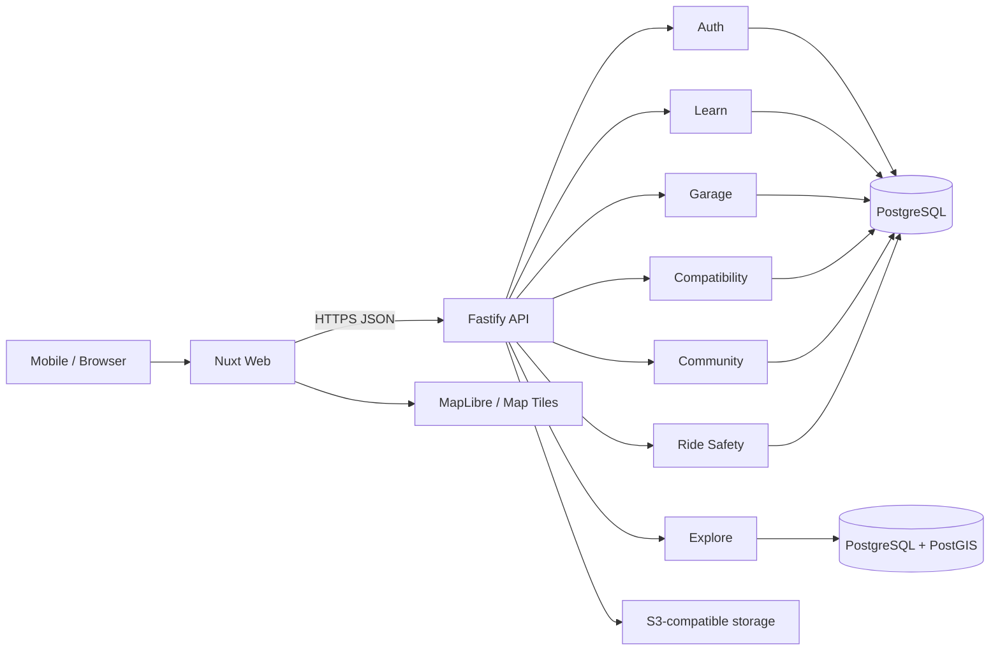
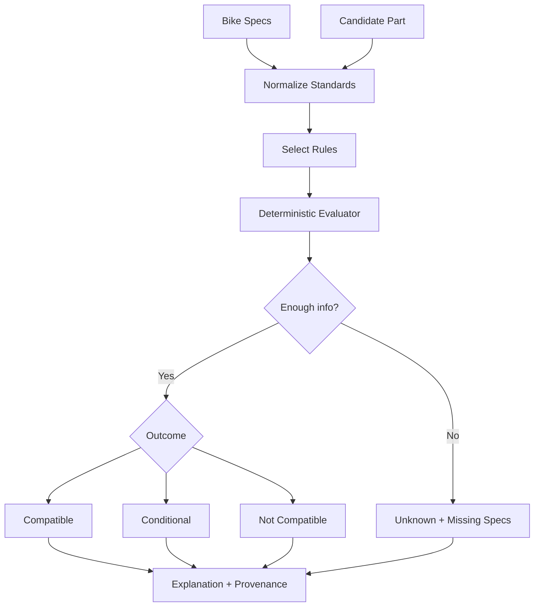
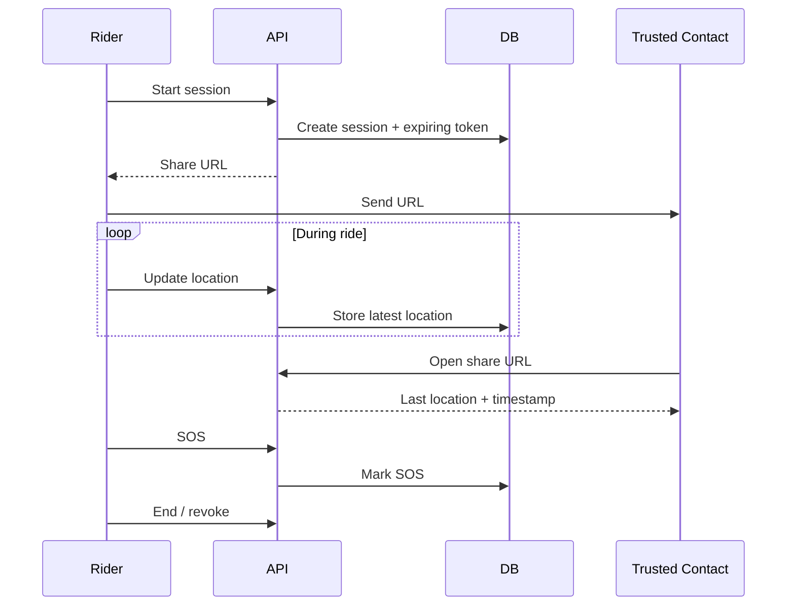

# Architecture

## Goals

- mobile-first;
- API-first;
- PostgreSQL-centered;
- PostGIS for location;
- deterministic compatibility;
- no unnecessary microservices;
- web/API independently deployable.

## Logical architecture



## MVP deployment

```text
Internet
  |
Load Balancer / Reverse Proxy
  |
  +-- Web
  |
  +-- API
       |
       +-- PostgreSQL + PostGIS
       +-- Object Storage
```

No Redis initially.

## Monorepo

```text
apps/web
apps/api
packages/contracts
packages/ui
packages/bike-domain
infra
```

## API modules

```text
/api/v1/auth
/api/v1/learn
/api/v1/bikes
/api/v1/components
/api/v1/compatibility
/api/v1/places
/api/v1/routes
/api/v1/communities
/api/v1/events
/api/v1/safety
/api/v1/maintenance
/api/v1/admin
```

## Compatibility engine



AI may explain rules but must not decide compatibility.

## Geo

Use PostGIS:

```text
place
route
hazard_report
place_review
route_report
```

Typical query:

```text
Find workshops within 10 km
ordered by distance + freshness + trust.
```

## Safety



## Search

V1:

```text
PostgreSQL full-text search + pg_trgm
```

No Elasticsearch/OpenSearch initially.

## Security

- secure session/token handling;
- strict input validation;
- rate limiting;
- signed object uploads;
- high-entropy safety tokens;
- location privacy;
- moderation/audit logs;
- secrets via env/secret manager.

## Observability

Minimum structured fields:

```text
request_id
user_id
module
latency
status_code
error_code
```

## Non-goals

Do not start with:

- Kubernetes;
- Kafka;
- service mesh;
- event sourcing;
- GraphQL federation;
- microservice per module;
- separate search cluster.
