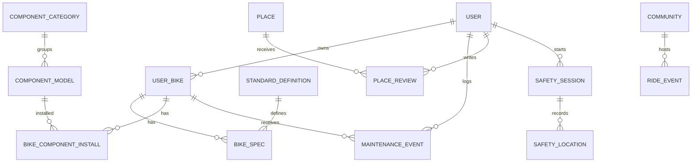

# Data Model



## Core entities

### users
```text
id
display_name
email
avatar_url
locale
created_at
updated_at
```

### bicycle_types
```text
id
slug
name
summary
typical_use
beginner_notes
```

Suggested slugs:

```text
mtb_hardtail
mtb_full_suspension
road
gravel
folding
city
touring
bmx
ebike
```

### component_categories
```text
frame
fork
rear_shock
wheel
hub
tire
cassette
chain
crank
bottom_bracket
rear_derailleur
shifter
brake
rotor
handlebar
stem
seatpost
saddle
pedal
folding_hinge
```

### standard_definitions

Normalized examples:

```text
AXLE_REAR_12X148
AXLE_REAR_12X142
AXLE_REAR_QR_9X135
FREEHUB_HG
FREEHUB_MICROSPLINE
FREEHUB_XD
BRAKE_POST_MOUNT
BRAKE_FLAT_MOUNT
STEERER_TAPERED
```

Fields:

```text
id
code
category
label
unit
schema_json
description
source_url
review_status
version
```

### user_bikes

```text
id
user_id
nickname
bicycle_type_id
brand
model
model_year
frame_size
frame_material
wheel_size
photo_url
notes
created_at
updated_at
```

### bike_specs

```text
id
user_bike_id
standard_definition_id
value_json
confidence
source
updated_at
```

Confidence:

```text
confirmed
user_entered
inferred
unknown
```

### compatibility_rules

```text
id
code
component_category_id
title
priority
conditions_json
result_template
severity
source_url
review_status
version
created_at
updated_at
```

### lessons

```text
id
slug
title
summary
level
bicycle_type_id
component_category_id
content_json
status
version
```

### places

```text
id
type
name
description
location geography(Point,4326)
address
bike_types
verification_status
last_confirmed_at
created_by
```

### routes

```text
id
name
route_type
geometry geography(LineString,4326)
distance_m
elevation_gain_m
difficulty
surface
bike_types
verification_status
last_confirmed_at
created_by
```

### communities

```text
id
slug
name
description
home_location geography(Point,4326)
bike_types
visibility
verification_status
```

### ride_events

```text
id
community_id
title
starts_at
meeting_location geography(Point,4326)
route_id
difficulty
bike_types
capacity
requirements
status
```

### safety_sessions

```text
id
user_id
started_at
expected_end_at
ended_at
status
share_token_hash
share_expires_at
sos_triggered_at
note
```

### safety_locations

```text
id
session_id
location geography(Point,4326)
accuracy_m
battery_pct
recorded_at
```

## Data rules

- no compatibility rule without provenance;
- unknown specs are never silently defaulted;
- local geo content carries freshness;
- safety locations have explicit retention;
- route/place history prefers soft archive when history matters.
