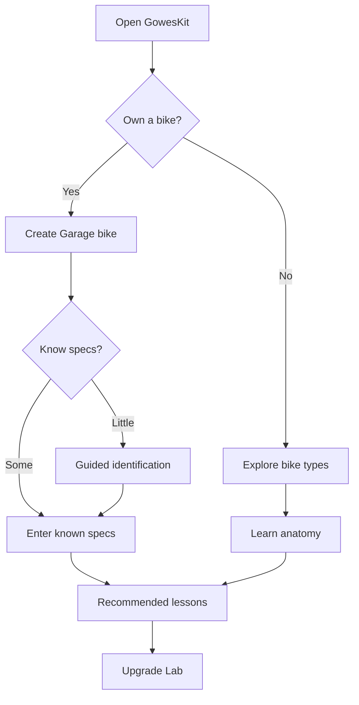
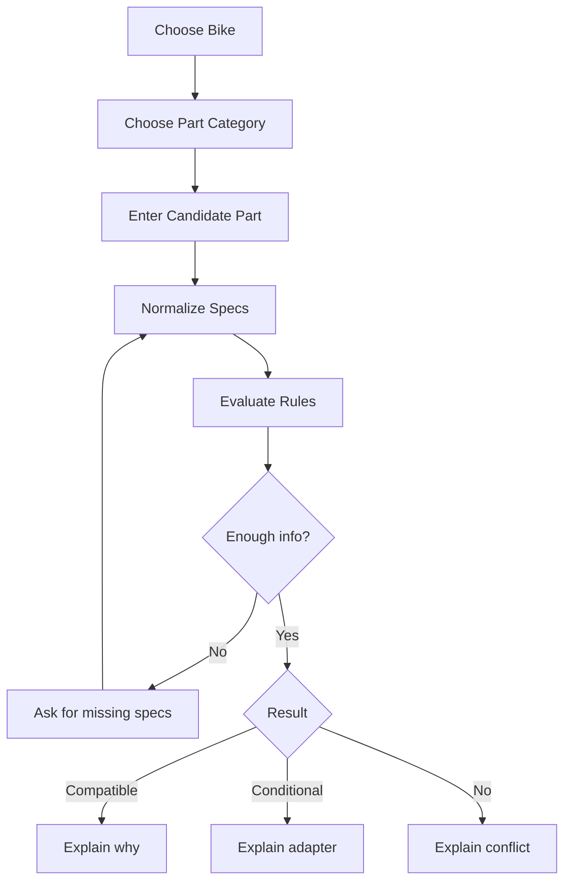
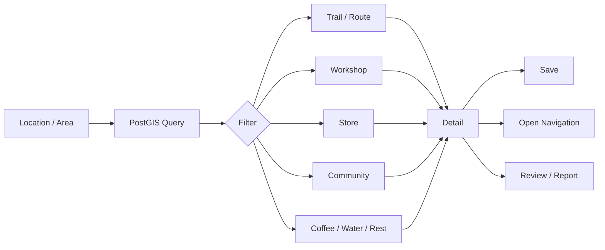
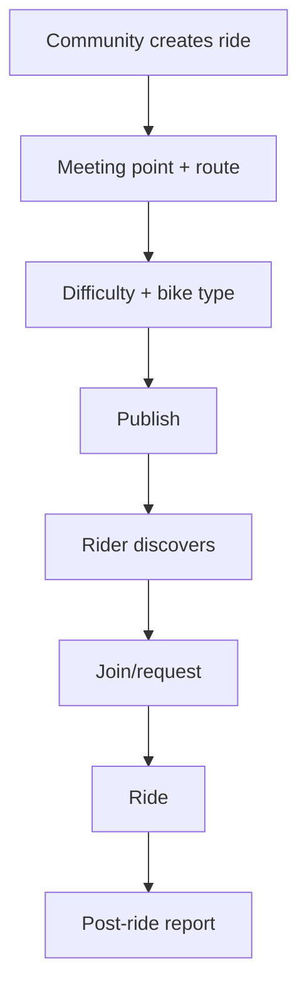
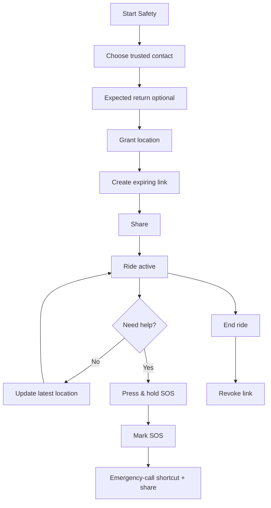

# Mermaid Flows

## Beginner flow

```mermaid
flowchart TD
    A[Open GowesKit] --> B{Own a bike?}
    B -- No --> C[Explore bike types]
    C --> D[Learn anatomy]
    B -- Yes --> E[Create Garage bike]
    E --> F{Know specs?}
    F -- Some --> G[Enter known specs]
    F -- Little --> H[Guided identification]
    H --> G
    G --> I[Recommended lessons]
    D --> I
    I --> J[Upgrade Lab]
```

## Compatibility flow

```mermaid
flowchart TD
    A[Choose Bike] --> B[Choose Part Category]
    B --> C[Enter Candidate Part]
    C --> D[Normalize Specs]
    D --> E[Evaluate Rules]
    E --> F{Enough info?}
    F -- No --> G[Ask for missing specs]
    G --> D
    F -- Yes --> H{Result}
    H -- Compatible --> I[Explain why]
    H -- Conditional --> J[Explain adapter]
    H -- No --> K[Explain conflict]
```

## Explore flow

```mermaid
flowchart LR
    L[Location / Area] --> Q[PostGIS Query]
    Q --> F{Filter}
    F --> T[Trail / Route]
    F --> W[Workshop]
    F --> S[Store]
    F --> C[Community]
    F --> P[Coffee / Water / Rest]
    T --> D[Detail]
    W --> D
    S --> D
    C --> D
    P --> D
    D --> SAVE[Save]
    D --> NAV[Open Navigation]
    D --> REPORT[Review / Report]
```

## Community ride

```mermaid
flowchart TD
    A[Community creates ride] --> B[Meeting point + route]
    B --> C[Difficulty + bike type]
    C --> D[Publish]
    D --> E[Rider discovers]
    E --> F[Join/request]
    F --> G[Ride]
    G --> H[Post-ride report]
```

## Solo ride safety

```mermaid
flowchart TD
    A[Start Safety] --> B[Choose trusted contact]
    B --> C[Expected return optional]
    C --> D[Grant location]
    D --> E[Create expiring link]
    E --> F[Share]
    F --> G[Ride active]
    G --> H{Need help?}
    H -- No --> I[Update latest location]
    I --> G
    H -- Yes --> J[Press & hold SOS]
    J --> K[Mark SOS]
    K --> L[Emergency-call shortcut + share]
    G --> M[End ride]
    M --> N[Revoke link]
```
