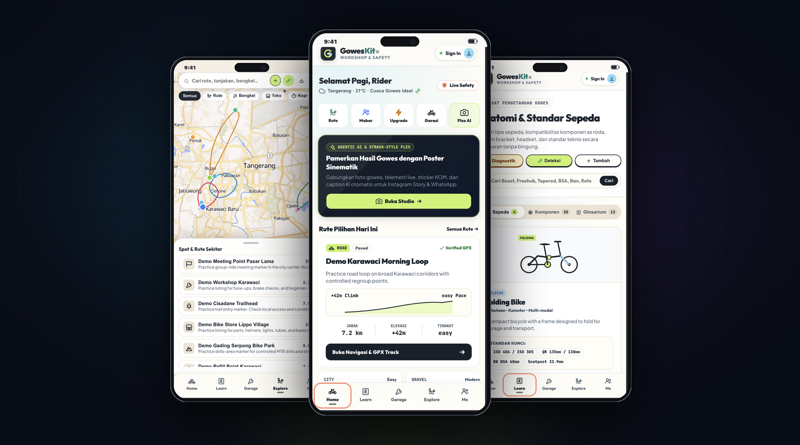
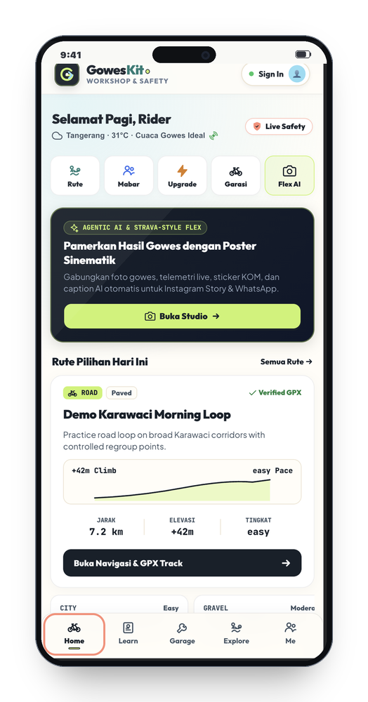
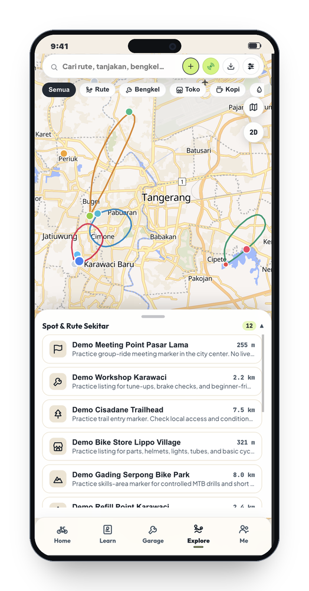
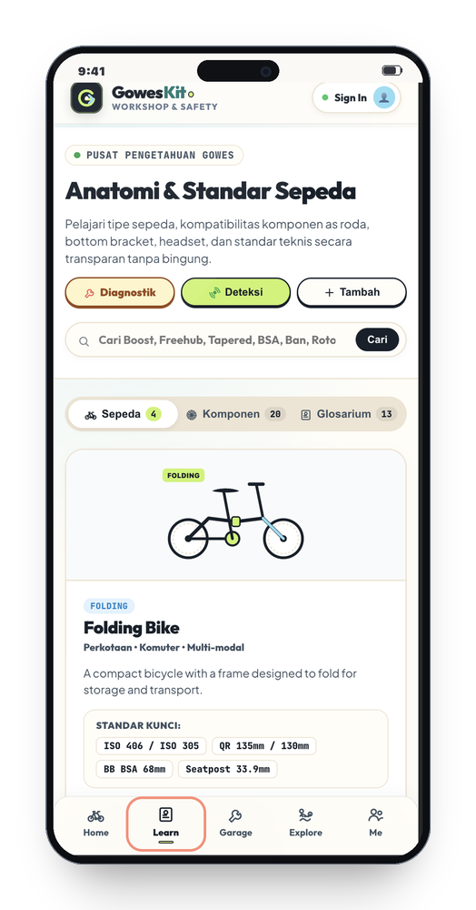
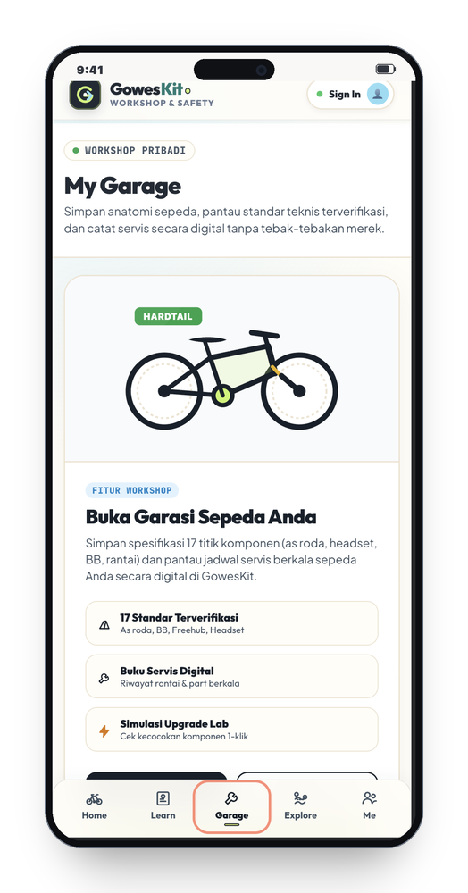
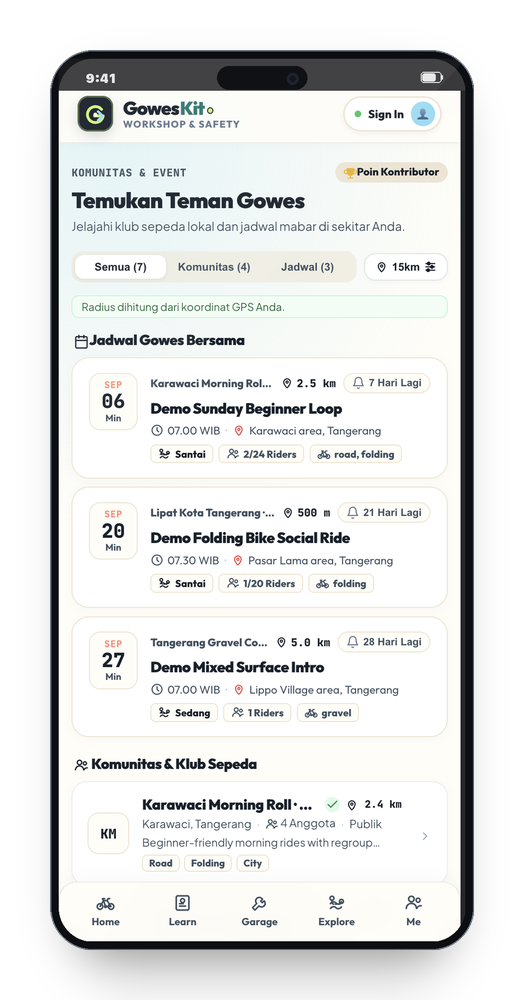
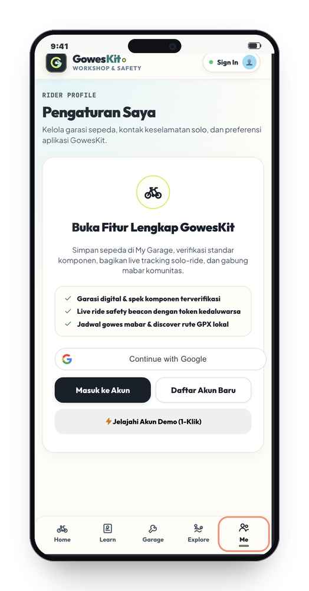

<div align="center">

# GowesKit
### Platform Cerdas, Paspor Sepeda & Manajemen Kompatibilitas Pesepeda

[](https://goweskit.demo.pandanteknik.com/)
[](https://www.typescriptlang.org/)
[](https://nuxt.com/)
[](https://www.fastify.io/)
[](https://postgis.net/)
[](https://vitest.dev/)
[](LICENSE)

<p align="center">
  Platform edukasi anatomi sepeda, manajemen inventaris (Garage), mesin audit kompatibilitas deterministik (Upgrade Lab), navigasi spasial PostGIS privacy-first, pelacak keselamatan solo-ride, dan poster studio data gowes.
</p>

<br />

<p align="center">
  <a href="https://goweskit.demo.pandanteknik.com/">
    
  </a>
</p>

<br />

[Live Demo](https://goweskit.demo.pandanteknik.com/) •
[Preview Visual](#preview-tampilan-aplikasi) •
[Mengapa GowesKit?](#mengapa-goweskit) •
[Fitur Utama](#fitur-utama--arsitektur-modul) •
[Standar Resmi](#transparansi-standar-resmi-industri) •
[Quick Start](#panduan-menjalankan-secara-lokal-quick-start) •
[Panduan Deploy](#panduan-deployment-ke-production-vps--cloud) •
[Donasi GoPay](#dukung-pengembangan-goweskit-donasi)

</div>

---

## Preview Tampilan Aplikasi

<div align="center">

| Beranda & Rute Pilihan | Navigasi & Pitstop Spasial | Anatomi & Standar Sepeda |
| :---: | :---: | :---: |
|  |  |  |
| **Garasi & Paspor Sepeda** | **Jadwal Mabar Komunitas** | **Profil Rider & Akun** |
|  |  |  |

</div>

---

## Mengapa GowesKit?

Pesepeda sering menghadapi dilema teknis saat merawat atau melakukan upgrade suku cadang sepedanya:

* *Apakah groupset 12-speed Shimano Micro Spline dapat dipasang pada freehub HG konvensional?*
* *Apakah fork tapered 1.5" dapat dipasang pada headtube straight 44mm tanpa mengganti headset cup?*
* *Bagaimana cara mencatat riwayat servis dan masa pakai rantai secara terukur?*
* *Di mana menemukan rute aman, bengkel terdekat, dan titik pitstop ramah pesepeda?*

**GowesKit** menjawab permasalahan tersebut melalui **Deterministic Compatibility Engine** berlandaskan standar baku industri resmi (ISO, SHIS, Park Tool, Shimano/SRAM), tanpa asumsi atau spekulasi.

---

## Fitur Utama & Arsitektur Modul

```text
                                    ┌───────────────────────┐
                                    │      GOWESKIT WEB     │
                                    │    (Nuxt 3 + Vue 3)   │
                                    └───────────┬───────────┘
                                                │
                 ┌──────────────────────────────┼──────────────────────────────┐
                 ▼                              ▼                              ▼
     ┌───────────────────────┐      ┌───────────────────────┐      ┌───────────────────────┐
     │    LEARN & GARAGE     │      │      UPGRADE LAB      │      │    EXPLORE & SAFETY   │
     │  - Anatomi 4 Kategori │      │  - Engine Deterministik│     │  - Radius PostGIS Map │
     │  - Paspor Sepeda      │      │  - 15 Standar Baku    │      │  - Live Safety Token  │
     │  - Log Servis Berkala │      │  - Provenance ISO/SHIS│      │  - Jadwal Mabar Klub  │
     └───────────────────────┘      └───────────────────────┘      └───────────────────────┘
                 │                              │                              │
                 └──────────────────────────────┼──────────────────────────────┘
                                                │
                                    ┌───────────▼───────────┐
                                    │      FASTIFY API      │
                                    │  (TypeScript Strict)  │
                                    └───────────┬───────────┘
                                                │
                                    ┌───────────▼───────────┐
                                    │     POSTGRESQL GIS    │
                                    │  (Drizzle ORM + GIS)  │
                                    └───────────────────────┘
```

### 1. Learn Center (Pusat Edukasi Sepeda)
* **4 Kategori Sepeda Utama**: Panduan anatomi mendalam untuk Road Bike, MTB Hardtail, Folding Bike (Seli), dan Gravel Bike.
* **Glosarium Istilah Interaktif**: Penjelasan standar teknis seperti Thru-Axle vs Quick Release, DUB vs Hollowtech II, Boost 148, UDH (Universal Derailleur Hanger), dan Flat Mount vs Post Mount.

### 2. My Garage & Paspor Sepeda Digital
* **Spesifikasi Terstruktur**: Dokumentasi komponen wheelset, bottom bracket, headset, groupset, rem, kokpit, dan saddle.
* **Explicit Unknown Tracking**: Jika ada dimensi komponen yang belum diketahui, sistem menandainya sebagai `Unknown` secara transparan dan menyediakan panduan pengukuran dengan caliper.
* **Paspor Sepeda Siap Audit**: Ringkasan spesifikasi terverifikasi untuk konsultasi langsung dengan mekanik.

### 3. Upgrade Lab (Mesin Kompatibilitas Deterministik)
* **Evaluasi Instan & Akurat**: Pilih sepeda Anda dan tentukan suku cadang target.
* **Status Hasil Terstandarisasi**:
  * **Compatible** — Plug & play sesuai standar baku.
  * **Conditional** — Memerlukan spacer, adapter crown race, atau freehub body konversi.
  * **Incompatible** — Tidak kompatibel secara mekanis atau geometri.
  * **Unknown Specs** — Membutuhkan konfirmasi data spesifikasi tambahan.
* **Provenance Audit Box**: Menampilkan versi aturan, nomor standar rujukan (ISO/SHIS), dan tanggal verifikasi untuk tiap evaluasi.

### 4. Explore & Navigasi Gowes (PostGIS Privacy-First)
* **Pencarian Fasilitas Gowes**: Menampilkan bengkel, toko suku cadang, pitstop kopi, minimarket, water station, dan jalur gowes terdekat.
* **Privasi Terlindungi**: Menggunakan kueri spasial PostGIS berbasis radius — koordinat pengguna tidak disimpan atau dipublikasikan.
* **OpenFreeMap & Offline Navigator**: Peta interaktif berbasis MapLibre yang tetap dapat diakses saat koneksi internet terbatas.

### 5. Komunitas & Jadwal Mabar
* **Direktori Klub Lokal**: Temukan dan bergabung dengan komunitas pesepeda (Road, MTB, Gravel, Foldie).
* **Jadwal Gowes Bareng**: Informasi meeting point, rute, profil elevasi, dan target pace kecepatan.
* **Status Keanggotaan**: Pengingat otomatis jadwal mabar dan pendaftaran anggota terintegrasi.

### 6. Ride Safety (Pelacak Solo-Ride & SOS)
* **High-Entropy Expiring Share Token**: Bagikan tautan pelacakan langsung sementara yang aman kepada kontak tepercaya.
* **Kontrol Penuh Pengguna**: Pelacakan hanya aktif atas inisiatif pengguna dan dapat dicabut/diakhiri seketika.

### 7. Maintenance Log & Interval Tracker
* **Pengingat Perawatan Berkala**: Rekomendasi servis rantai, pengecekan brake pads, bleeding minyak rem hidrolik, hingga servis suspensi.
* **Riwayat Servis**: Dokumentasi catatan mekanik untuk menjaga performa dan nilai kendaraan.

### 8. Ride Flex Studio AI
* **Poster Generator Data Gowes**: Mengubah data sesi gowes menjadi format visual modern untuk Instagram Story (9:16), Feed Post (1:1), atau Banner (16:9).
* **4 Gaya Desain**: Strava Bold, Rapha Editorial, Cyber HUD, dan Kopi & Sate.
* **Spektrum Elevasi & Rute GPS**: Visualisasi jalur GPS dengan glowing track dan waypoint pitstop.
* **Generator Caption AI Multi-Persona**: Menghasilkan caption bertema Peloton Pro, Komuter Santai, Mekanik Senior, dan Santai Kulineran.

---

## Transparansi Standar Resmi Industri

Mesin evaluasi GowesKit mengacu secara ketat pada dokumen standar resmi:

1. **ISO 5775-1 / ISO 4210**: Dimensi ban, diameter velg (ETRTO/BSD: 622mm, 584mm, 406mm, 451mm), dan keselamatan rangka sepeda.
2. **SHIS (Standardized Headset Identification System)**: Standar identifikasi headset Cane Creek, FSA, dan Park Tool (EC, ZS, IS).
3. **Park Tool Bottom Bracket & Axle Standards**: Standar ulir (BSA, Italian), PressFit (BB86, BB92, PF30, BB30, T47), dan diameter poros (DUB 28.99mm, 24mm Spindle, 30mm Spindle).
4. **Shimano & SRAM Official Compatibility Matrices**: Standar spline freehub (HG, Micro Spline, XD/XDR) dan rasio tarikan kabel derailleur.

---

## Tech Stack

| Komponen | Teknologi | Keterangan |
|---|---|---|
| **Frontend** | Nuxt 3, Vue 3, TypeScript | Mobile-first PWA, SSR & SPA mode |
| **Styling** | Vanilla CSS Variables, Tailwind CSS | Ringan, konsisten dengan GowesKit Design System |
| **Backend API** | Fastify, TypeScript Strict | High-performance async REST API, validasi Zod |
| **Database & GIS** | PostgreSQL 16+ / 18, PostGIS | Relational schema dengan query spasial `ST_DWithin` |
| **ORM & Migrations** | Drizzle ORM | Type-safe SQL migrations & schema definitions |
| **Monorepo** | pnpm workspaces | Manajemen modul independen |
| **Maps** | MapLibre GL JS, OpenFreeMap | Peta vektor open-source tanpa ketergantungan API pihak ketiga |
| **Testing** | Vitest | 79 test files dengan cakupan unit, contract, dan integration |

---

## Panduan Menjalankan Secara Lokal (Quick Start)

### Persyaratan Sistem:
* Node.js: `v22.0.0` atau lebih baru
* pnpm: `v10.0.0` atau lebih baru (`npm install -g pnpm`)
* PostgreSQL: `v16+` / `v18` dengan ekstensi **PostGIS** aktif

### 1. Instalasi PostgreSQL & PostGIS (macOS Homebrew)
```bash
brew install postgresql@18 postgis
brew services start postgresql@18
createdb -h localhost -U $(whoami) goweskit
```

*(Opsi Docker)*
```bash
docker compose -f infra/docker-compose.yml up -d
```

### 2. Kloning Repositori & Setup Environment
```bash
git clone https://github.com/RiprLutuk/goweskit.git
cd goweskit
cp .env.example .env
pnpm install
```

### 3. Migrasi Database & Seeding Data
```bash
pnpm db:migrate
pnpm db:seed
```

### 4. Jalankan Server Pengembangan
```bash
pnpm dev
```
* **Frontend Web**: [http://localhost:3000](http://localhost:3000) (atau port 3001)
* **Backend API**: [http://localhost:4000](http://localhost:4000) (atau port 4001)

**Akun Demo:**
* **Email**: `demo@goweskit.local`
* **Password**: `GowesKitDemo123!`

---

## Panduan Deployment ke Production (VPS / Cloud)

### Opsi 1: Deployment via Docker Compose

1. Siapkan VPS (Ubuntu 22.04 / 24.04 LTS).
2. Install Docker & Docker Compose:
   ```bash
   sudo apt update && sudo apt install -y docker.io docker-compose-plugin
   ```
3. Clone repository & konfigurasi `.env`:
   ```bash
   git clone https://github.com/RiprLutuk/goweskit.git /var/www/goweskit
   cd /var/www/goweskit
   cp .env.example .env
   nano .env
   ```
4. Build dan jalankan container:
   ```bash
   docker compose -f infra/docker-compose.prod.yml up -d --build
   docker compose -f infra/docker-compose.prod.yml exec api pnpm db:migrate
   docker compose -f infra/docker-compose.prod.yml exec api pnpm db:seed
   ```

---

### Opsi 2: Deployment Native PM2 & Nginx Reverse Proxy

1. **Build Monorepo**:
   ```bash
   pnpm install --frozen-lockfile
   pnpm build
   ```

2. **Jalankan Proses dengan PM2**:
   ```bash
   npm install -g pm2
   pm2 start apps/api/dist/index.js --name "goweskit-api" --env PORT=4000
   pm2 start apps/web/.output/server/index.mjs --name "goweskit-web" --env PORT=3000
   pm2 save
   pm2 startup
   ```

3. **Konfigurasi Nginx** (`/etc/nginx/sites-available/goweskit`):
   ```nginx
   server {
       listen 80;
       server_name yourdomain.com www.yourdomain.com;

       location / {
           proxy_pass http://127.0.0.1:3000;
           proxy_http_version 1.1;
           proxy_set_header Upgrade $http_upgrade;
           proxy_set_header Connection 'upgrade';
           proxy_set_header Host $host;
           proxy_cache_bypass $http_upgrade;
       }

       location /api/ {
           proxy_pass http://127.0.0.1:4000;
           proxy_http_version 1.1;
           proxy_set_header Host $host;
           proxy_set_header X-Real-IP $remote_addr;
           proxy_set_header X-Forwarded-For $proxy_add_x_forwarded_for;
           proxy_set_header X-Forwarded-Proto $scheme;
       }
   }
   ```

4. **Aktifkan SSL dengan Certbot**:
   ```bash
   sudo ln -s /etc/nginx/sites-available/goweskit /etc/nginx/sites-enabled/
   sudo nginx -t && sudo systemctl reload nginx
   sudo certbot --nginx -d yourdomain.com -d www.yourdomain.com
   ```

---

## Quality Gates & Pengujian

```bash
# 1. Format & Linting Check
pnpm lint
pnpm format:check

# 2. TypeScript Strict Typecheck
pnpm typecheck

# 3. Jalankan Seluruh Test Suite
pnpm test
```

---

## Dukung Pengembangan GowesKit (Donasi)

GowesKit dikembangkan secara independen dan open-source untuk memajukan kultur pesepeda di Indonesia. Jika aplikasi ini bermanfaat untuk perawatan sepeda, eksplorasi rute, dan perencanaan upgrade Anda, Anda dapat memberikan apresiasi donasi untuk mendukung pemeliharaan server dan riset suku cadang.

> **Catatan**: Donasi hanya dapat dipindai secara langsung melalui aplikasi **GoPay**.

<div align="center">
  <br />
  <a href="https://github.com/RiprLutuk/PasPapan/blob/main-vps/screenshots/donation-qr.jpeg" target="_blank" rel="noopener noreferrer">
    
  </a>
  <br /><br />
  <p><strong>Scan QR di atas langsung menggunakan Aplikasi GoPay</strong></p>
  <p><a href="https://github.com/RiprLutuk/PasPapan/blob/main-vps/screenshots/donation-qr.jpeg" target="_blank">Lihat Gambar Asli QR GoPay (PasPapan Repository)</a></p>
</div>

---

## Lisensi

Proyek ini didistribusikan di bawah lisensi **MIT**. Lihat file `LICENSE` untuk informasi selengkapnya.

